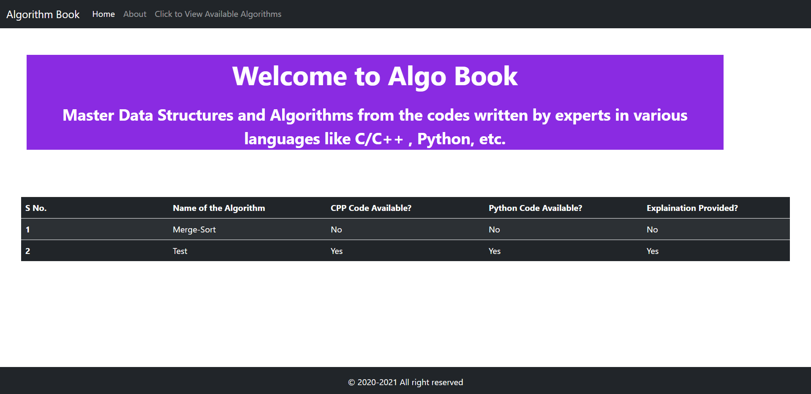
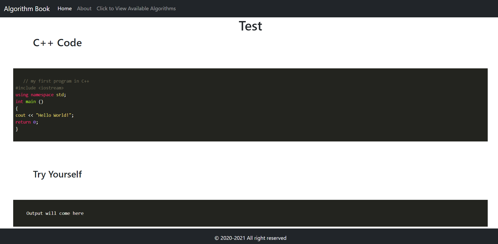

# Welcome to Algo Book

Algo Book is a web app made by developers to master your Data Structures and Algorithms so that you can crack major coding interviews and master competitive coding. We will provide codes for all sorts of algorithms and data structures that are asked in interviews. These codes are verified by our experts.

## Excited ? Let's go on  :smile:

## Features

1. This Web App has a built-in Compiler for the languages supported to show the code output.(Currently, it only supports python)
2. It has a syntax highlighter for the languages supported.

 

## Languages that we use

 
</a>  </a>  

  

## Are you a Contributor?

Hey there, if you find that there is any sort of algorithm or data structure that has not been covered here then this section is for you. Even if you wish to contribute in any particular programming language which is not present here, then feel free to do so.

### Steps to be followed while contributing

1. If you have proposed a new algorithm/data-structure which is not present in this repository then you are supposed to make a new directory inside <strong>Codes</strong> folder with the name of the algorithm.
2. All sorts of code files should be present inside the codes folder. 
3. Please try to provide a README.md file which should contain a brief explanation of the algorithm. (Try to provide pictures if possible)
4. If you are done, create a PR for this branch. It will be reviewed by me before adding it to the website.

  

## Preview of App

  

  

## Installation and Usage

1. Install Python Interpreter from their official website.
2. Install required dependencies using requirements.txt as follows:

~~~bash
# Install Required Dependencies
pip install < requirements.txt
~~~
3. To run the website, use the following commands:
~~~bash
# Make Desired Migrations
python manage.py makemigrations
python manage.py migrate
# Start Website 
python manage.py runserver
~~~

# Any Doubts?

## Feel free to Contact me :smiley:

    